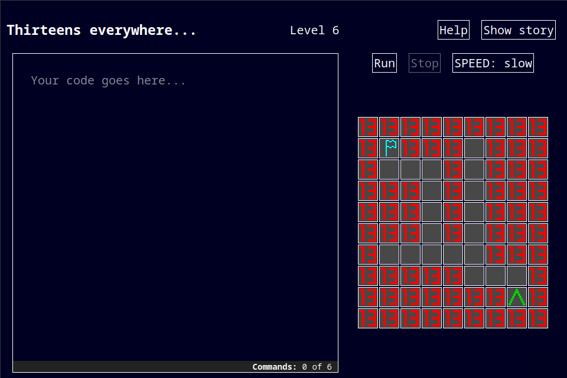

# Thirteens everywhere

You need to reach the flag. You have a robot JSK-13 to do this.

Unfortunately, the robot has a triskadekaphobia. It means that it is afraid of thirteens and it will break down if he meet one.

Write a program for the robot and reach flags!



# How to build

You'll need Python 3.8+ to build the game.

```
git clone https://github.com/mallo-c/js13k-entry-2024.git
cd js13k-entry-2024
yarn install
yarn build
```

A file named `dist.zip` will appear.
